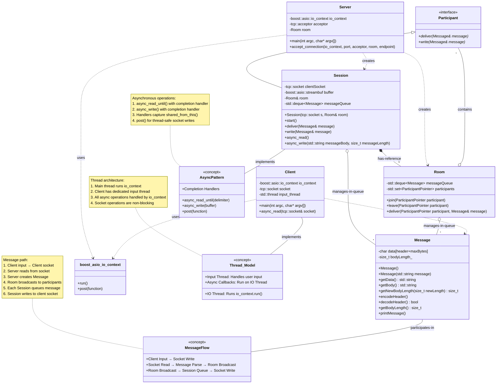

# ChatMesh : Multi-Client Asynchronous TCP Chat Server  
**C++, Makefile, Boost.Asio, Sockets, Threading, OOPs**

Modular TCP-based chat system designed in C++ using Boost.Asio, featuring session management, message queuing, and real-time broadcasting.

---

## Description

ChatMesh is a terminal-based, asynchronous chat server built in modern C++ using Boost.Asio. It allows multiple clients to connect and exchange messages in real-time. The server efficiently handles multiple connections using asynchronous I/O without blocking threads.

This system models each client as an independent session and places all active clients in a shared room. Clients can send messages to the server, which then relays them to all other connected participants (except the sender). The architecture is modular, maintainable, and object-oriented.

The project is ideal for demonstrating system-level programming, socket-based networking, concurrency, message handling, and real-time event-driven design using Boost.Asio.

---

## Features

- Asynchronous I/O using Boost.Asio
- Multi-client support via TCP sockets
- Message queue with real-time delivery
- OOP design with Room, Session, and Message abstractions
- Thread-safe, non-blocking architecture
- Custom message encoding/decoding with header
- Lightweight and efficient

---

## LLD Diagram

Reference : Lovepreet

---

## Architecture Flow (Message Lifecycle)

`./assets/chatroom-flow.png`

---
## Code Structure and Component Explanation

### 1. `message.hpp`  
Defines the structure of a message.

- `header = 4` bytes: encodes the length of the message body
- `maxBytes = 512`: max body length allowed
- `encodeHeader()`: stores message length into first 4 bytes
- `decodeHeader()`: reads the 4-byte header to extract body length
- `getBody()`: returns the actual message
- `getData()`: returns the complete encoded message (header + body)

**Purpose:**  
To safely send and receive messages with known sizes over TCP sockets.

---

### 2. `chatRoom.hpp`  
Declares the main entities: `Participant`, `Room`, and `Session`.

- **`Participant`**: Abstract interface defining deliver() and write()
- **`Room`**: Manages all participants, accepts message deliveries, and broadcasts messages to others
- **`Session`**: Represents a single connected client and handles read/write using Boost.Asio async APIs

---

### 3. `chatRoom.cpp`  
Implements the logic of server-side message handling.

#### Functions:

- `Room::join()`: Adds a new participant
- `Room::leave()`: Removes a participant
- `Room::deliver()`: Sends message to all participants except sender

- `Session::start()`: Begins reading messages and joins room
- `Session::async_read()`: Reads asynchronously using `boost::asio::async_read_until`
- `Session::async_write()`: Sends message back to client
- `Session::write()`: Decodes the message and triggers async_write
- `Session::deliver()`: Passes message to the room

- `accept_connection()`: Accepts new TCP connections and spawns sessions
- `main()`: Initializes Boost.Asio I/O context and starts listening for clients

---

### 4. `client.cpp`  
Implements the client that connects to server.

- Establishes TCP connection using `boost::asio::connect`
- `async_read()` function continuously listens to messages from server
- Accepts user input in a separate thread
- Sends user-entered messages using `boost::asio::write`

---

## How the Features Are Implemented

| Feature                  | How It Is Implemented |
|--------------------------|------------------------|
| Asynchronous I/O         | Using `boost::asio::async_read_until` and `async_write` |
| Multi-client handling    | Each client gets a `Session` object. All sessions are stored in a `Room`. |
| Real-time broadcasting   | Messages delivered to room are sent to all other participants |
| Message formatting       | Each message includes a 4-byte header storing the body length |
| Thread safety            | All socket operations are async and run via Boost I/O context |
| OOP design               | Abstract `Participant` interface, separate classes for message, session, room |

---

## How to Run

### Important: This project must be run on Linux

This project uses system headers (`sys/socket.h`, `unistd.h`) not available on native Windows. It must be built and run inside WSL2 or any Linux system.

---

### Steps to Run using VS Code + WSL (Ubuntu)

1. **Install WSL and Ubuntu:**
   - Open PowerShell as admin  
     `wsl --install`  
     (or install Ubuntu via Microsoft Store)

2. **Install VS Code Extension:**
   - Install `Remote - WSL` extension

3. **Reopen the folder in WSL:**
   - VS Code → Ctrl+Shift+P → "WSL: Reopen Folder in WSL"

4. **Install dependencies in WSL terminal:**
   -`sudo apt update`
   -`sudo apt install build-essential libboost-all-dev` 

5. Build the project:
    `make`

6. Start the server:
    `./chatApp 8080` 

7. Start clients in other terminals:
    `./clientApp 8080` 

---

## Demo Output (Server + Client)

`./assets/chatmesh-demo-output.png`

---

## Demo Video

`./assets/chatmesh-demo.mp4`

---

## Author

Kishan Raj
NIT Allahabad
